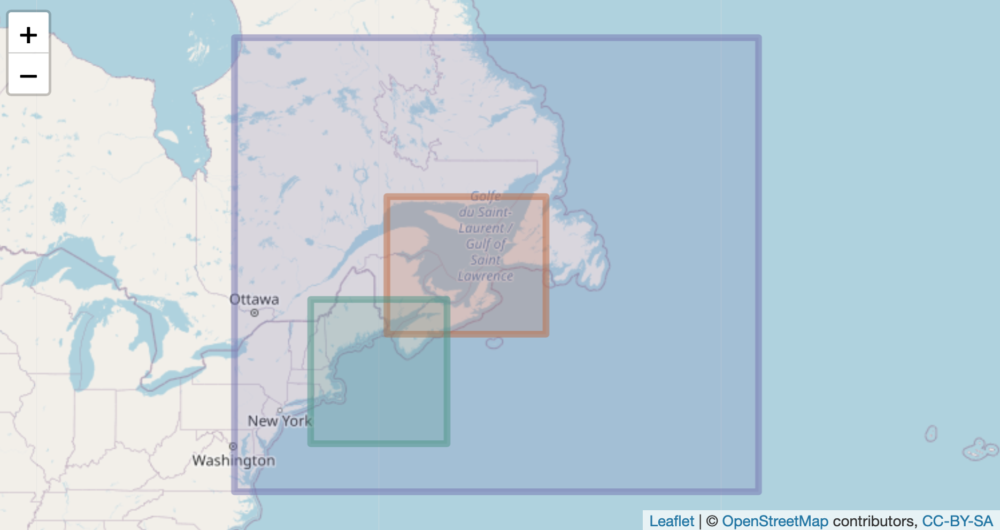

cofbb
================

This R package serves the spatial bounding box definitions we use in the
Record Lab.

### Requirements

- [R v4+](https://www.r-project.org/)

- [rlang](https://CRAN.R-project.org/package=rlang)

- [dplyr](https://CRAN.R-project.org/package=dplyr)

- [sf](https://CRAN.R-project.org/package=sf)

### Suggested

- [leaflet](https://CRAN.R-project.org/package=leaflet)

### Installation

    remotes::install_github("BigelowLab/cofbb")

### Usage

Retrieve a table of all known bounding boxes.

``` r
cofbb::get_table()
```

    ## # A tibble: 18 × 6
    ##    name                xmin  xmax  ymin  ymax longname                       
    ##    <chr>              <dbl> <dbl> <dbl> <dbl> <chr>                          
    ##  1 maine              -71.1 -67    43    47.5 State of Maine                 
    ##  2 gom                -72   -63    39    46   Gulf of Maine                  
    ##  3 gom_carcharodon    -74.9 -63    38.8  46   GoM for White Sharks           
    ##  4 nwa_orig           -77   -51.5  37.9  56.7 Northwest Atlantic             
    ##  5 nwa                -77   -42.5  36.5  56.7 Northwest Atlantic 2           
    ##  6 nwa2               -77   -42.5  36.5  56.7 Northwest Atlantic 2           
    ##  7 neac               -74   -59.8  41    48.2 New England and Atlantic Canada
    ##  8 liac               -74   -59.8  37.9  48.2 Long Island and Atlantic Canada
    ##  9 gosl               -67   -56.5  44.4  50.5 Gulf of St. Lawrence           
    ## 10 world             -180   180   -90    90   World                          
    ## 11 world360             0   360   -90    90   World 360                      
    ## 12 njgb               -74.9 -66    38.8  42.6 New Jersey to Georges Bank     
    ## 13 nefsc_carcharodon  -74.9 -65    38.8  46   NEFSC White Shark              
    ## 14 cape_cod           -69.2 -70.9  41.4  42.2 Cape Cod                       
    ## 15 cold_blob          -30   -15    42    60   North Atalantic Cold Blob      
    ## 16 warm_spot          -74   -58    36    42   Warm Spot                      
    ## 17 nh                -180     0   180    90   Northern Hemisphere            
    ## 18 sh                -180   -90   180     0   Southern Hemisphere

Retrieve one or more regions by name as a table.

``` r
cofbb::get_bb(c("world", "nwa2"), form = "table")
```

    ## # A tibble: 2 × 6
    ##   name   xmin  xmax  ymin  ymax longname            
    ##   <chr> <dbl> <dbl> <dbl> <dbl> <chr>               
    ## 1 nwa2    -77 -42.5  36.5  56.7 Northwest Atlantic 2
    ## 2 world  -180 180   -90    90   World

Retrieve one or more regions by name as a list of vector in
`[xmin, xmax, ymin, ymax]` order.

``` r
cofbb::get_bb(c("world", "nwa2"), form = "bb")
```

    ## $world
    ## xmin xmax ymin ymax 
    ## -180  180  -90   90 
    ## 
    ## $nwa2
    ##  xmin  xmax  ymin  ymax 
    ## -77.0 -42.5  36.5  56.7

Or retrieve just one as a vector

``` r
cofbb::get_bb("gom", form = "bb")
```

    ## xmin xmax ymin ymax 
    ##  -72  -63   39   46

### Ancillary Functions

There are also functions for making `[-180, 180]` \<-\> `[0,360]`
longitude transformations (`to_180BB()`, `to_360BB()`), splitting
bounding boxes (`bb_split()`) and determining if a box straddles a
particular line of longitude (`bb_straddles()`).

### [sf](https://CRAN.R-project.org/package=sf)

You can also retrieve bounding boxes as a data frame of one or more
[sf](https://CRAN.R-project.org/package=sf) POLYGON objects.

``` r
x <- cofbb::get_bb(c("gosl", "gom", "nwa2"), form = "sf")
x
```

    ## Simple feature collection with 3 features and 1 field
    ## Geometry type: POLYGON
    ## Dimension:     XY
    ## Bounding box:  xmin: -77 ymin: 36.5 xmax: -42.5 ymax: 56.7
    ## Geodetic CRS:  WGS 84
    ##   name                           geom
    ## 1 gosl POLYGON ((-67 44.4, -56.5 4...
    ## 2  gom POLYGON ((-72 39, -63 39, -...
    ## 3 nwa2 POLYGON ((-77 36.5, -42.5 3...

If you have [leaflet](https://CRAN.R-project.org/package=leaflet)
installed you can draw a pretty map (otherwise a boring map is drawn.)

    plot_bb(x)

<figure>

<figcaption aria-hidden="true">leaflet</figcaption>
</figure>

# NOTE on `nwa` and `nwa2`

As of 2025-03-10 `nwa` has been renamed `nwa_orig` but it is essentially
deprecated. `nwa` and `nwa2` now point to the same bounding box which
modified from `nwa_orig` to accommodate Flemish Cap. The point is,
calling for `nwa` and `nwa2` is now the same thing.
